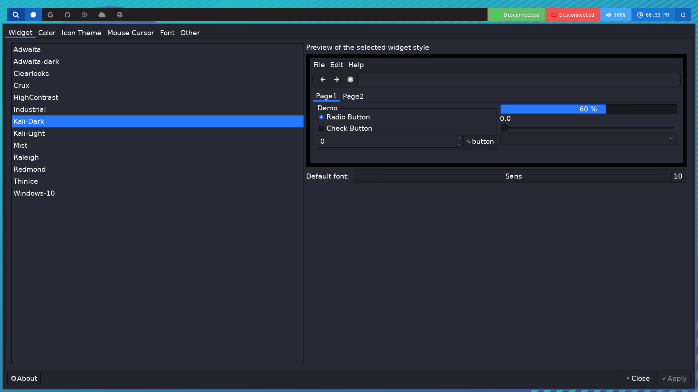

My dotfiles version 1.0 files and my bspwm configuration.

Then depending on the operating system or its derivative you will have to install some packages.

### Debian Linux
For Debian and derivates (**Kali,Parrot,Ubuntu**) execute:
```bash
sudo apt update && sudo apt install -y bash wget git unzip tmux sudo caja flameshot bspwm sxhkd polybar rofi zsh terminator nitrogen openvpn xclip net-tools zsh lsd bat lxappearance zsh-autosuggestions zsh-syntax-highlighting
```

### Arch Linux
For Arch Linux and derivates execute:
```bash
sudo pacman -Sy bash wget git unzip tmux sudo caja flameshot bspwm sxhkd polybar rofi zsh terminator nitrogen openvpn xclip net-tools zsh lsd bat lxappearance
```

### RedHat Linux
For RedHat Linux and derivates (**Fedora,Alma,Rocky**) execute:
```bash
sudo dnf update && sudo dnf install bash wget git unzip tmux sudo caja flameshot bspwm sxhkd polybar rofi zsh terminator nitrogen openvpn xclip net-tools zsh lsd bat lxappearance
```

## Possible mistakes
In case your distribution does not have the necessary packages or they are outdated, you will have to install the packages manually, I leave you a complete list with the packages that you should install:

* git
* wget
* git
* unzip
* bash
* zsh
* tmux
* sudo
* caja
* bspwm
* sxhkd
* polybar
* rofi
* terminator
* nitrogen
* openvpn
* xclip 
* net-tools
* lsd
* bat
* lxappearance

**This is not necessary in Kali and Fedora (where I have tested them) except for bat which taught you to urge it below**.

### BAT


Because bat is the package that is not found even in Kali Linux, I will show you how to install it in Kali and derivatives:
```bash
cd ~
wget https://github.com/sharkdp/bat/releases/download/v0.18.2/bat_0.18.2_amd64.deb
sudo dpkg -i bat_0.18.2_amd64.deb
rm bat_0.18.2_amd64.deb
```
In case your architecture is different, I leave you the GitHub repository of bat [github.com/sharkdp/bat](https://github.com/sharkdp/bat).

### LSD


Because lsd is the package that is not found even in Kali Linux, I will show you how to install it in Kali and derivatives:
```bash
cd ~
wget https://github.com/Peltoche/lsd/releases/download/0.20.1/lsd-musl_0.20.1_amd64.deb
sudo dpkg -i lsd-musl_0.20.1_amd64.deb
rm lsd-musl_0.20.1_amd64.deb
```
In case your architecture is different, I leave you the GitHub repository of bat [github.com/Peltoche/lsd](https://github.com/Peltoche/lsd).

And you will have to do it like this with every missing dependency on your system.

## Installation
After installing all the dependencies install the configuration. To install my configuration it is as simple as executing:

```bash
git clone https://github.com/kyb3rfett/dotfiles.git
cd dotfiles
chmod +x install.sh
bash install.sh
```
After completing these steps you should exit the session and select the bspwm desktop environment on your login screen.


## Personalizate
To customize the polybar you can right click on the magnifying glass icon in the polybar:


### Screen size
By default the screen that comes in the configuration is 1920x1080, if your screen has another configuration you can place it in ~/.config/bspwm/bspwmrc on line number 4.

### Wallpaper
The path where the wallpaper images are saved is **~/.wallpapers**, there you must add your favorite wallpapers and to change it you must press the key combination: **super + shift + w**



If you want the wallpapers that your system brings, example those of your distribution, execute:
```bash
cd ~
ln -s -f /usr/share/backgrounds .wallpapers
```


### Icons and theme
To change the icon theme, system theme and mause pointer you can search for lxappearance in rofi and there adjust to your liking.



## Shortcuts
### BSPWM
* **Restart** - super + alt + r
* **Lock system** - super + l
* **Exit** - super + alt + q

### Launchers
* **Terminal** - super + enter
* **File Explorer** - super + e
* **Browser (Firefox)** - super + shift + b
* **BurpSuite** - super + shift + p
* **Rofi** - super + d
* **Nitrogen** - super + shift + w
* **Screenshot** - super + shift + s

### Resize window
* **Full Screen** - super + t
* **Minize window** - super + s

### Accommodate window


Remember that these shortcuts only work if you are already in **minized window** mode.


* **Up window** - super + up
* **Down window** - super + down
* **Move window right** - super + right
* **Move window left** - super + left
* **Make the window smaller** - super + alt + shift + keys (up,down,right,left)


To create a new shortcut you must go to **~/.config/sxhkd/sxhkdrc** and edit the file.

Example:


In this example a shortcut is created to open the metasploit (command) with the key combination: super +shift + k, remember that after creating the shortcut you must restart BSPWM.


## Screenshots


## Tweet
